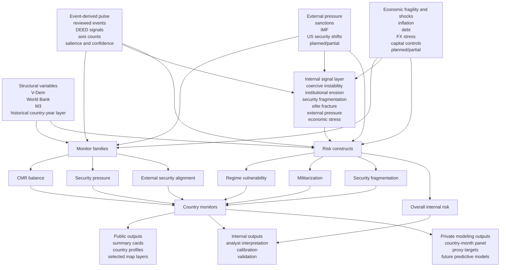

# SENTINEL Private Variable And Construct Diagram

This document is private/internal. It tracks how variables and constructs feed
the country measures in the project.

Update this diagram whenever a new structural variable, event-derived signal,
construct, or monitor family is added.

Private visual output:

- [private-construct-diagram.svg](/Users/hjmoncrieff/Library/CloudStorage/Dropbox/SENTINEL/docs/private-construct-diagram.svg)

## Variable-To-Construct Map

## Current Construct Logic

- `regime_vulnerability`
  - regime type and democratic fragility
  - governance erosion
  - state-capacity weakness
  - DEED-style institutional erosion
  - selected recent destabilizing signals
- `militarization`
  - military domestic-coercion role
  - military governance-administration role
  - military economic-control role
  - broader civil-military structure
  - supporting pulse from relevant events
- `security_fragmentation`
  - organized-crime density
  - territorial spread of coercive stress
  - conflict and criminality pressure
  - weak state capacity and fragmented coercive order
- `overall internal risk`
  - should aggregate construct-level pressure rather than raw signal counts

Current signal-layer logic:

- the private signal panel is now intended to feed:
  - `regime_vulnerability`
  - `militarization`
  - `security_fragmentation`
  - and a top-line internal-only overall risk layer

Current placeholder families:

- external pressure variables are now reserved in the panel contract
- economic fragility and policy-shock variables are now reserved in the panel
  contract
- those families can now be seeded locally at the country-month level before
  full automated ingestion exists

## Maintenance Rule

When variables or constructs change, update:

- `data/CODEBOOK.md`
- `docs/baseline-pulse-design.md`
- this diagram

in the same change set.
