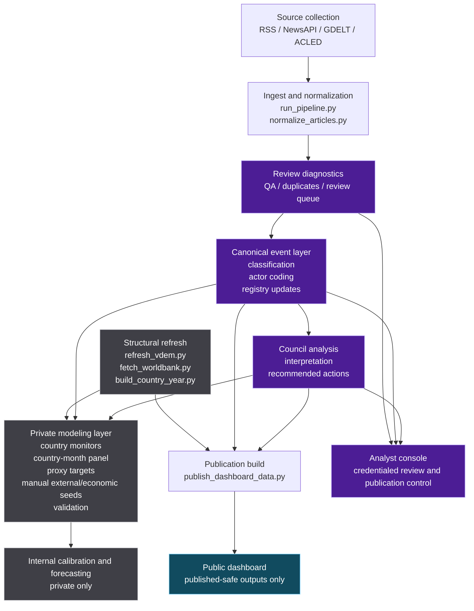

# SENTINEL Private Integration Diagram

This document is private/internal. It tracks how decisions and outputs move
from data collection through internal analysis to the public dashboard.

Update this diagram whenever stage boundaries, core runners, or publication
contracts change.

Private visual output:

- [private-integration-diagram.svg](/Users/hjmoncrieff/Library/CloudStorage/Dropbox/SENTINEL/docs/private-integration-diagram.svg)

## End-To-End Integration

## Surface Logic

- public dashboard:
  - only published-safe outputs
  - no local review data
  - no private modeling artifacts
- analyst console:
  - review and publication workspace
  - can consume internal review and council layers
  - should not expose the private modeling layer directly unless intentional
- private modeling layer:
  - structural refresh
  - calibration
  - country-month panels
  - target design
  - forecasting experiments
  - validation notes

## Decision Rule

If a new stage, dataset, or model output is introduced, decide explicitly:

- public
- internal analyst
- private modeling

Then update this diagram in the same pass.
