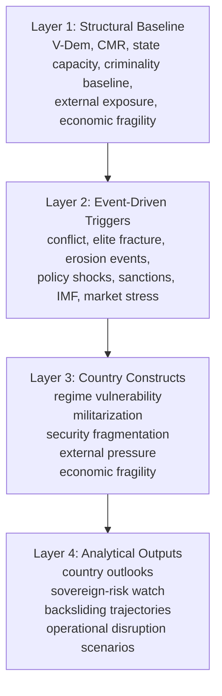

# SENTINEL Private Risk Architecture Note

This note is intentionally private/internal for now. It is a design document for
the next expansion of SENTINEL's country-risk architecture and should not be
linked from the public dashboard or public-facing documentation yet.

## Why Expand The Current Model

The current architecture is strongest on:

- civil-military relations
- militarization
- regime vulnerability
- security fragmentation
- live-event pulse logic

The next design step is to make the model more explicitly capable of handling:

- external pressure
- economic fragility
- policy shocks
- sovereign-risk transmission

This matters because political and security outcomes in Latin America are often
shaped not only by domestic coercive dynamics, but also by:

- US pressure and security posture
- sanctions imposition or relief
- IMF engagement and conditionality
- sudden economic-policy reversals
- capital-control or nationalization signals
- commodity and external-finance exposure

## Proposed Layered Architecture

The model should evolve toward a four-layer logic.

### Layer 1: Structural Baseline

Slow-moving variables that set the country's risk floor.

Candidate baseline families:

- regime trajectory
- civil-military relations
- state capacity
- security and criminality baseline
- external alignment and exposure
- economic fragility
- resource dependence

Representative inputs:

- V-Dem regime and democracy measures
- military prerogatives and mission-role structure
- governance and rule-of-law indicators
- bureaucratic and administrative-state measures
- ACLED criminality/conflict baselines
- sanctions history
- IMF program history
- reserves/debt/inflation/FX vulnerability
- commodity concentration and external-finance dependence

### Layer 2: Event-Driven Triggers

High-frequency signals that shift scenario probabilities.

Candidate trigger families:

- conflict and coercive escalation
- elite fractures
- institutional erosion events
- policy shocks
- external pressure shocks
- economic disruption signals

Representative triggers:

- protests, clashes, purges, coups, organized-crime escalations
- cabinet reshuffles, command changes, defections
- DEED-style erosion signals
- sanctions announcements or removal
- IMF rupture, new program, or conditionality shock
- nationalization and expropriation signals
- capital controls
- emergency decrees affecting markets or sector governance

### Layer 3: Country Constructs

These are the interpretable country-level constructs SENTINEL should expose and
validate.

Current constructs:

- regime vulnerability
- militarization
- security fragmentation

Proposed additions or explicit parallel constructs:

- external pressure
- economic fragility

Even if only three constructs are shown publicly at first, the architecture
should still allow external and economic components to feed them.

Current implementation direction:

- the country-month panel now includes explicit external/economic contract fields for:
  - external pressure
  - economic fragility
  - economic policy shocks
- the project now also has a tracked private contract for these families in:
  - `config/modeling/panel_feature_contract.json`
- and a local manual-seed path for country-month values through:
  - `data/modeling/manual_country_month_signals.local.json`
- these are not yet populated with live data, but the field layer now exists so
  the modeling architecture can grow without redesigning the panel contract

### Layer 4: Transmission / Use-Case Outputs

This layer converts country constructs into more specific analytical outputs.

Possible outputs:

- sovereign-risk outlook
- democratic backsliding trajectory
- security-governance deterioration
- investor or operational disruption watch
- publication-grade country briefs

## Recommended Construct Logic

### 1. Regime Vulnerability

Definition:

- the near-term vulnerability of the governing order to rupture, coercive
  overreach, elite-security strain, or institutional erosion

Should be fed by:

- democratic fragility
- governance erosion
- state capacity weakness
- DEED/institutional erosion pulse
- elite fracture signals
- external pressure when it affects regime room for maneuver
- economic fragility when it sharpens regime stress

### 2. Militarization

Definition:

- the degree to which armed forces expand into domestic coercion, governance,
  and state administration

Should be fed by:

- military mission roles
- public-security mandates
- domestic coercion profile
- executive-military entanglement
- military veto/impunity
- crisis-driven expansion of military governance tasks

### 3. Security Fragmentation

Definition:

- the extent to which coercive order is dispersed, contested, territorially
  uneven, or partially detached from routine state control

Should be fed by:

- organized-crime density and spread
- conflict and violence pulse
- territorial state-capacity weakness
- local-to-national spillover
- collusion and hybrid coercive arrangements

### 4. External Pressure

Definition:

- the degree to which external actors and external constraints are pushing the
  state's political and security choices

Candidate signals:

- sanctions imposition/removal
- OFAC-style designations
- IMF negotiation, rupture, or new program
- shifts in US security cooperation
- abrupt diplomatic/security alignment changes

This may remain an internal construct at first, even if it is not shown as a
public dashboard card.

### 5. Economic Fragility

Definition:

- the extent to which macroeconomic vulnerability increases the likelihood that
  political and security stress will become harder to manage

Candidate signals:

- debt stress
- reserve weakness
- inflation acceleration
- FX instability
- capital controls
- nationalization or expropriation signals
- commodity dependence

This should not replace political-risk logic. It should act as a conditioning
layer that interacts with regime vulnerability and external pressure.

## Internal Signal Panel Layer

SENTINEL should also prototype a private/internal signal panel that sits
between raw events and episode/process reasoning.

Purpose:

- help analysts identify episode formation
- support process detection
- provide a compact internal monitoring surface for benchmark countries

Current design direction:

- spec note:
  - `docs/private-signal-panel-note.md`
- machine-readable scaffold:
  - `config/modeling/internal_signal_panel_spec.json`

Recommended first series:

- coercive instability
- institutional erosion
- security fragmentation
- elite fracture
- external pressure
- economic stress / policy shock

Recommended integration:

- these signal series should feed the three main constructs:
  - regime vulnerability
  - militarization
  - security fragmentation
- then those construct-level signal pressures should feed a top-line
  internal-only overall risk measure

This keeps the signal panel aligned with the rest of the country-risk
architecture instead of becoming a disconnected monitoring screen.

This should remain internal and should not be exposed on the public dashboard
until the logic is validated.

## State Capacity As A Cross-Cutting Structural Factor

State capacity should become an explicit structural input rather than being
proxied only through broad governance variables.

A composite state-capacity measure should likely feed all major constructs.

Why:

- weak capacity raises regime vulnerability
- weak civilian capacity can encourage militarization
- weak territorial and administrative reach raises security fragmentation
- weak fiscal and administrative capacity also amplifies economic fragility

Candidate components:

- government effectiveness
- rule of law
- bureaucratic quality / administrative state quality
- corruption control
- service-delivery or implementation capacity when available
- coercive reach versus territorial unevenness

Potential initial implementation:

- build `state_capacity_composite`
- store it in the cleaned country-year layer
- feed it into:
  - `regime_vulnerability`
  - `militarization`
  - `security_fragmentation`
  - later `economic_fragility`

Current interpretation rule:

- `state_capacity_composite` should not feed all constructs symmetrically
- it should weigh most directly on:
  - `regime_vulnerability`
  - `security_fragmentation`
- and more conditionally on:
  - `militarization`
  where it operates through civilian weakness and mission substitution rather
  than as a direct stress multiplier

## External Signals To Prioritize

The first external signals worth formalizing are:

- sanctions
- IMF programs
- US security posture shifts

Reason:

- they are analytically important
- they often have clear timing
- they matter across multiple countries
- they can be represented in both structural and pulse form

Suggested split:

- structural:
  - sanctions history
  - IMF dependency/exposure
  - long-run US security dependence
- pulse:
  - new sanctions
  - sanctions easing/removal
  - IMF rupture
  - IMF agreement/conditionality announcement
  - major US aid/cooperation change

## Policy-Shock Layer

SENTINEL should also add an explicit policy-shock family.

Important examples:

- nationalization and expropriation
- capital-control announcements
- emergency regulatory changes
- abrupt subsidy/tariff/FX regime shifts
- security-law changes with economic impact

These matter because they often sit at the boundary between:

- regime vulnerability
- external pressure
- economic fragility

## Suggested Documentation Diagram

The project should eventually include a visual model-spec diagram similar in
spirit to the reference image, but adapted to SENTINEL's own logic.

Private draft structure:

## Near-Term Build Order

Recommended sequence:

1. Build a V-Dem refresh/extraction stage for structural expansion.
2. Add `state_capacity_composite` to the cleaned structural layer.
3. Add internal config scaffolding for:
   - `external_pressure`
   - `economic_fragility`
4. Define historical + pulse inputs for:
   - sanctions
   - IMF programs
   - policy shocks
5. Decide which of these become:
   - public constructs
   - internal-only constructs
   - cross-cutting conditioning variables
6. Add benchmark cases and validation notes for the new layers.

## Open Design Question

The central strategic choice is whether SENTINEL should expose:

- three public headline constructs only

or:

- three public constructs plus additional internal constructs that feed them

Current recommendation:

- keep the public layer concise
- let the internal model be richer than the public presentation
- treat `external_pressure` and `economic_fragility` as internal first-class
  constructs even if they are not immediately public dashboard cards
